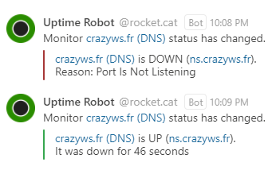

<p align="center"></p>

<p align="center">
  <a href="https://github.com/sponsors/crazy-max"></a>
  <a href="https://www.paypal.me/crazyws"></a>
</p>

## :warning: Abandoned project

This project is not maintained anymore and is abandoned. Feel free to fork and make your own changes if needed.

Thanks to everyone for their valuable feedback and contributions.

## About

Add [Uptime Robot](https://uptimerobot.com) notifications via a new WebHook in Rocket.Chat.

## Receive alerts

- Create a new **Incoming WebHook** in Administration > Integrations
- Select the channel where you will receive the alerts. You may wish to create a dedicated channel for your notifications.
- Select an account from which the alerts will be posted. You may wish to create a dedicated account just for notifications.
- Set the "Enable Scripts" option to `True`.
- Copy content of [uptimerobot-incoming.js](src/uptimerobot-incoming.js) in Script field.
- Save the integration. This will generate a webhook URL and secret for you.
- Go to [Uptime Robot -> MySettings](https://uptimerobot.com/dashboard.php#mySettings), add a **new Alert Contact** and select type **Web-Hook**
- Add the Rocket.Chat webhook URL generated in **URL to notify** field and add a **?** at the end of the URL.
- Paste the following in the **POST Value (JSON Format)** field :

```json
{
  "monitorID": "*monitorID*",
  "monitorURL": "*monitorURL*",
  "monitorFriendlyName": "*monitorFriendlyName*",
  "alertType": "*alertType*",
  "alertTypeFriendlyName": "*alertTypeFriendlyName*",
  "alertDetails": "*alertDetails*",
  "alertDuration": "*alertDuration*"
}
```

- And check **Send as JSON (application/json)**



*Note:* If status is UP, message color is green otherwise it is red.

## How can I help ?

All kinds of contributions are welcome :raised_hands:! The most basic way to show your support is to star :star2: the project, or to raise issues :speech_balloon: You can also support this project by [**becoming a sponsor on GitHub**](https://github.com/sponsors/crazy-max) :clap: or by making a [Paypal donation](https://www.paypal.me/crazyws) to ensure this journey continues indefinitely! :rocket:

Thanks again for your support, it is much appreciated! :pray:

## License

MIT. See `LICENSE` for more details.
